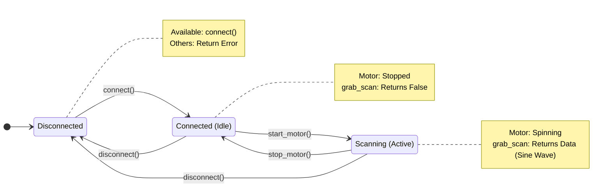

```mermaid
stateDiagram-v2
    direction LR

    %% state definition
    state "Disconnected" as OFF
    state "Connected (Idle)" as IDLE
    state "Scanning (Active)" as RUN

    %% 1. Disconnected
    [*] --> OFF
    note right of OFF
        Available: connect()
        Others: Return Error
    end note

    %% 2. Connected
    OFF --> IDLE : connect()
    IDLE --> OFF : disconnect()

    note right of IDLE
        Motor: Stopped
        grab_scan: Returns False
    end note

    %% 3. Scanning
    IDLE --> RUN : start_motor()
    RUN --> IDLE : stop_motor()
    RUN --> OFF : disconnect()

    note right of RUN
        Motor: Spinning
        grab_scan: Returns Data (Sine Wave)
    end note
```
