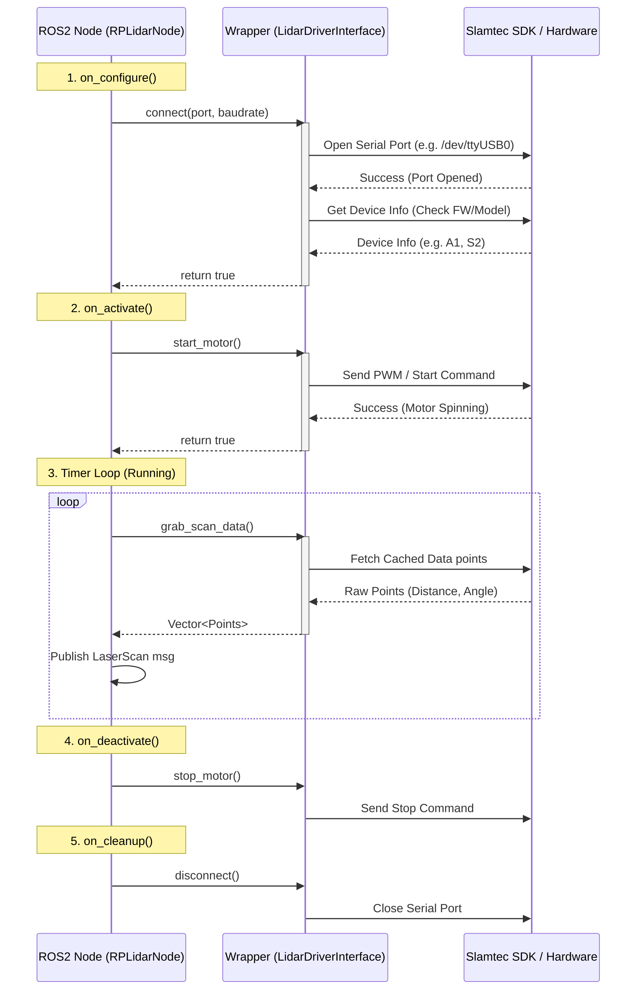

```mermaid
sequenceDiagram
    participant Node as ROS2 Node (RPLidarNode)
    participant Driver as Wrapper (LidarDriverInterface)
    participant SDK as Slamtec SDK / Hardware

    Note over Node: 1. on_configure()
    Node->>Driver: connect(port, baudrate)
    activate Driver
    Driver->>SDK: Open Serial Port (e.g. /dev/ttyUSB0)
    SDK-->>Driver: Success (Port Opened)
    Driver->>SDK: Get Device Info (Check FW/Model)
    SDK-->>Driver: Device Info (e.g. A1, S2)
    Driver-->>Node: return true
    deactivate Driver

    Note over Node: 2. on_activate()
    Node->>Driver: start_motor()
    activate Driver
    Driver->>SDK: Send PWM / Start Command
    SDK-->>Driver: Success (Motor Spinning)
    Driver-->>Node: return true
    deactivate Driver

    Note over Node: 3. Timer Loop (Running)
    loop
        Node->>Driver: grab_scan_data()
        activate Driver
        Driver->>SDK: Fetch Cached Data points
        SDK-->>Driver: Raw Points (Distance, Angle)
        Driver-->>Node: Vector<Points>
        deactivate Driver
        Node->>Node: Publish LaserScan msg
    end

    Note over Node: 4. on_deactivate()
    Node->>Driver: stop_motor()
    Driver->>SDK: Send Stop Command

    Note over Node: 5. on_cleanup()
    Node->>Driver: disconnect()
    Driver->>SDK: Close Serial Port
```
